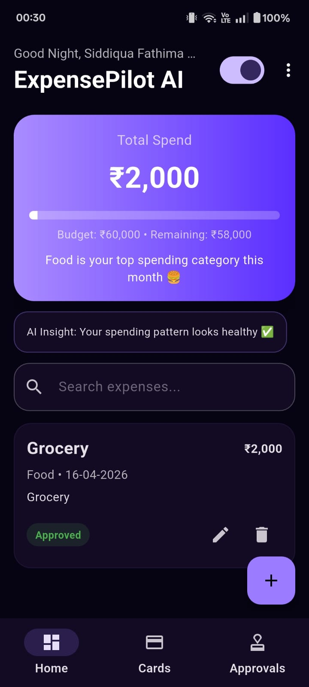
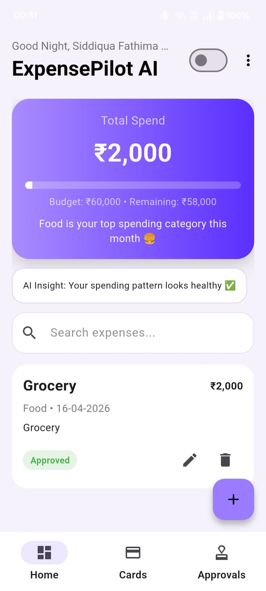
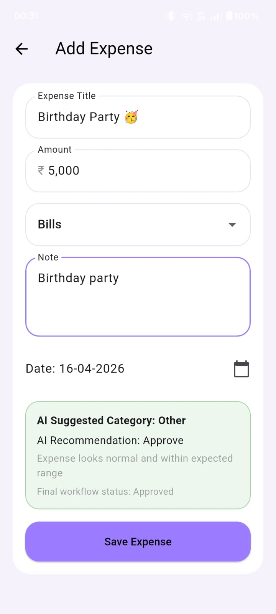
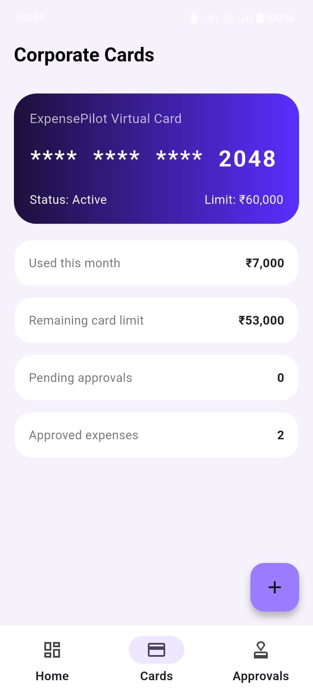
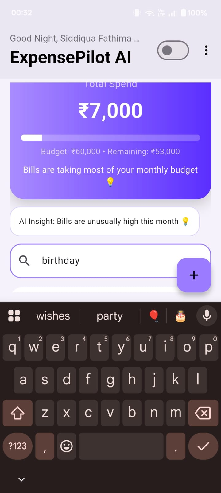
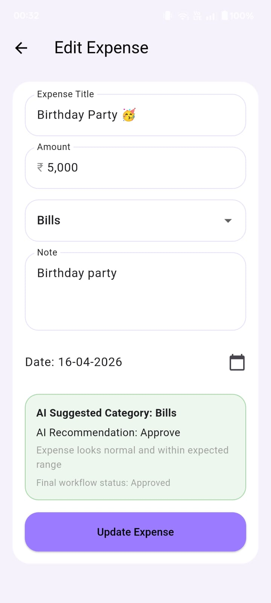

# ExpensePilot AI

ExpensePilot AI is a Flutter-based fintech mobile app inspired by modern corporate spend platforms. It helps users track expenses, manage budgets, view card-style spend summaries, and receive AI-like approval recommendations and financial insights.

## Features

- User onboarding with name, monthly budget, and timezone
- Personalized greeting based on saved timezone
- Dark mode and light mode
- Smart dashboard with:
  - total spend
  - budget progress
  - remaining budget
  - AI insights
- Add expense with:
  - formatted currency input
  - category selection
  - note
  - date picker
  - AI suggested category
  - AI recommendation
  - approval workflow status
- Corporate card-inspired screen
- Approval center screen
- Search expenses
- Local data storage using SharedPreferences

## Tech Stack

- Flutter
- Dart
- Provider
- SharedPreferences
- Intl
- currency_text_input_formatter

## AI Logic

This project uses a rule-based AI prototype instead of a real AI API.  
It simulates:
- expense category suggestions
- approval recommendations
- budget alerts
- spending insights

This MVP approach was used to validate the user experience and product workflow before integrating real AI APIs or ML models.

## Screenshots

### Splash Screen

### Onboarding

### Dashboard Dark Mode

### Dashboard Light Mode

### Add Expense with AI Recommendation

### Corporate Cards

### Approvals Center

### Search

## Project Goal

The goal of this project is to demonstrate how a Flutter mobile application can be designed for a fintech/corporate expense management use case with smart recommendations, clean UI, and product-oriented thinking.

## Future Improvements

- Real AI API integration
- Receipt upload and OCR
- Expense analytics charts
- Admin approval actions
- Multi-user team support
- Cloud database integration